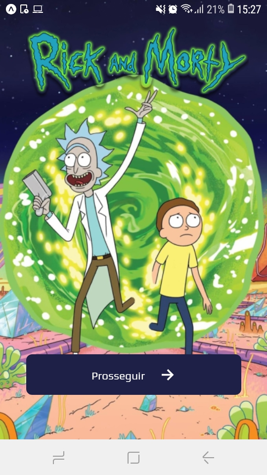
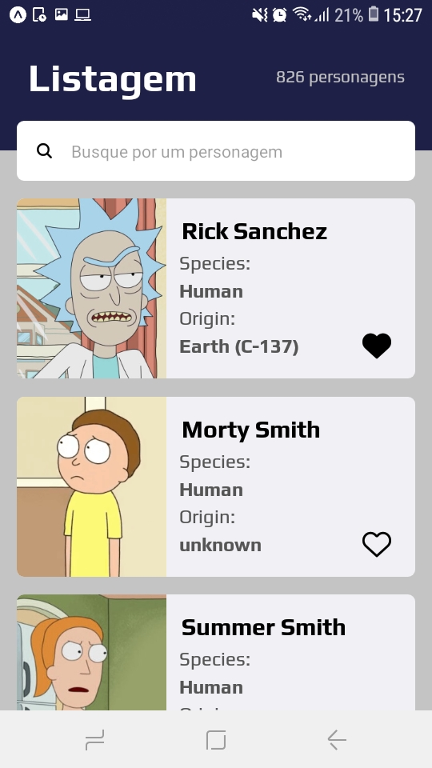
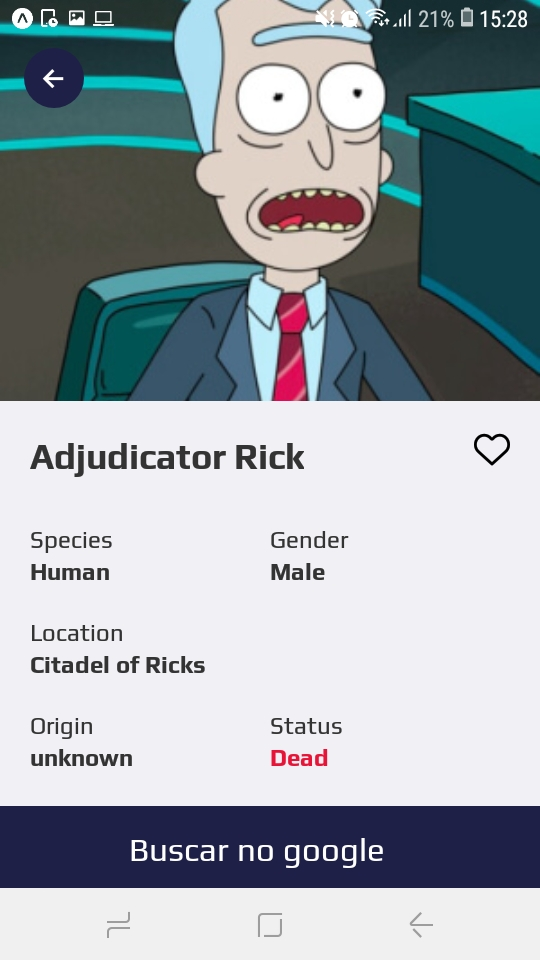

<h1 align="center">
Aplicativo rickandmorty
</h1>
Aplicativo para visualizar e favoritar os personagens da animação Rick and Morty. No aplicativo também é possível pesquisar os personagens por nome
e principalmente visualizar os detalhes de cada um deles. 


## Index
- [Screenhots](#Screenhots)
- [Pré-requisitos](#Pré-requisitos)
- [Rodando a aplicação no windows](#Rodando-a-aplicação-no-windows)
- [tecnologias](#tecnologias)


## Screenshots

<div align="center">
  
  
  
</div>

## Pré-requisitos

Antes de iniciar o projeto será necessário ter instalado na máquina o Nodejs, e algum gerenciador de pacotes, nesse projeto foi utilizado o npm.


## Rodando a aplicação no windows


```bash
# Clone este repositório
$ git clone <https://github.com/ezequias21/rickandmorty.git>

# Acesse a pasta do projeto no terminal/cmd
$ cd rickandmorty

# Instale o expo-cli
npm install -g expo-cli

# Instale as dependências
$ npm install

# Inicie um servidor local de desenvolvimento
$ npm start

# O servidor inciará na porta 19002 - acesse <http://localhost:19002>
#Com o aplicativo Expo em seu celular, scanei o QR Code que aparecerá no terminal ou na página web na porta 19002
```
## Tecnologias

O aplicativo foi desenvolvido usando as seguintes tecnologias

- [Expo](https://expo.io/)
- [React Native](https://reactnative.dev/)
- [TypeScript](https://www.typescriptlang.org/)

